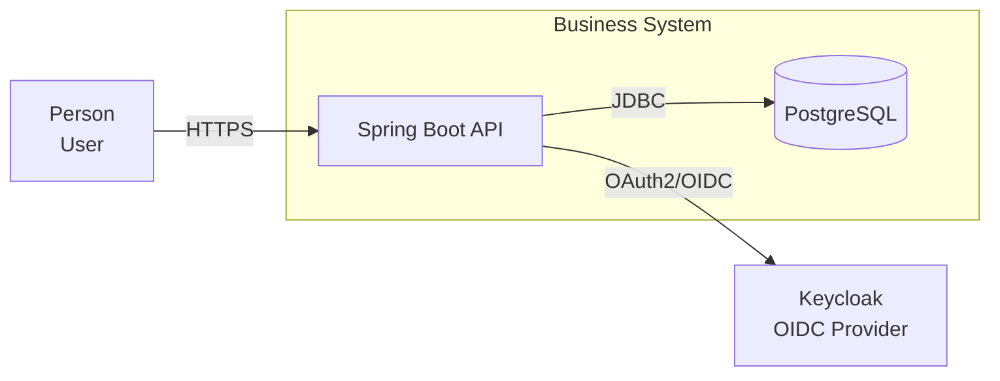

# GitHub Copilot Architecture Agent Suite

> **AI-assisted Solution Architecture for Java, Spring Boot, Cloud-Native, Kubernetes, Security and Architecture-Aware Code Review**

This repository provides a reusable **GitHub Copilot custom-agent suite** for professional software and solution architecture.

The agents are designed to work as a **virtual architecture team**, with each specialist focusing on a specific architectural concern while maintaining a common architectural language based on **C4, Mermaid, ADRs and engineering quality principles**.

The goal is not to replace architects or engineers.

The goal is to make experienced architects and engineers **faster, more consistent and more thorough**, while reducing the amount of repetitive architecture documentation and analysis.

---

# 1. What Is This Project?

This project contains a collection of GitHub Copilot custom agents that can be used during the complete software-development lifecycle.

```text
                         ┌──────────────────────────┐
                         │   Business Requirements   │
                         └────────────┬─────────────┘
                                      │
                                      ▼
                         ┌──────────────────────────┐
                         │  solution-architect      │
                         │                          │
                         │  System Context          │
                         │  Containers              │
                         │  Architecture Drivers    │
                         │  ADRs                    │
                         └────────────┬─────────────┘
                                      │
                    ┌─────────────────┼─────────────────┐
                    │                 │                 │
                    ▼                 ▼                 ▼
          ┌─────────────────┐ ┌───────────────┐ ┌──────────────────┐
          │ springboot-     │ │ security-     │ │ kubernetes-      │
          │ architect       │ │ architect     │ │ architect        │
          │                 │ │               │ │                  │
          │ Components      │ │ OAuth2/OIDC   │ │ Workloads        │
          │ APIs            │ │ Authorization │ │ Networking       │
          │ Data            │ │ Secrets       │ │ Resilience       │
          │ Messaging       │ │ Threats       │ │ GitOps           │
          └────────┬────────┘ └───────────────┘ └────────┬─────────┘
                   │                                     │
                   └──────────────────┬──────────────────┘
                                      ▼
                         ┌──────────────────────────┐
                         │     code-reviewer        │
                         │                          │
                         │ Architecture consistency │
                         │ Security                 │
                         │ Resilience               │
                         │ Testing                  │
                         │ Maintainability          │
                         └──────────────────────────┘
```

The agents are deliberately separated by responsibility.

This allows a team to ask the **right specialist the right question**, rather than expecting one generic AI assistant to understand every aspect of a complex solution equally well.

---

# 2. Who Is This Repository For?

The project can be used by several different audiences.

| Audience               | Primary use                                               |
| ---------------------- | --------------------------------------------------------- |
| Solution Architect     | Overall solution architecture and architectural decisions |
| Software Architect     | Application and service architecture                      |
| Java Developer         | Spring Boot design and implementation guidance            |
| Backend Developer      | APIs, persistence, messaging and resilience               |
| Platform Engineer      | Kubernetes, Helm, GitOps and workload architecture        |
| DevOps Engineer        | Deployment, CI/CD and operational architecture            |
| Security Architect     | Identity, authorization, secrets and threat modeling      |
| Technical Lead         | Architecture review and technical decision making         |
| Developer              | Understanding architecture before implementation          |
| Reviewer               | Architecture-aware code review                            |
| Project / Product Lead | Understanding system boundaries and dependencies          |
| Enterprise Architect   | High-level system landscape and architecture governance   |

The important principle is:

> **Different people should use different agents according to the question they are trying to answer.**

---

# 3. The Agent Suite

The repository currently contains five specialist agents.

```text
.github/
└── agents/
    ├── solution-architect.agent.md
    ├── springboot-architect.agent.md
    ├── kubernetes-architect.agent.md
    ├── security-architect.agent.md
    └── code-reviewer.agent.md
```

---

# 4. `solution-architect`

## Purpose

The `solution-architect` is the **overall architecture coordinator**.

Use it when the question concerns the solution as a whole.

Typical questions:

```text
How should we structure this system?

What are the correct system boundaries?

Should this be a modular monolith or microservices?

What external systems are involved?

Who owns the data?

What are the major architecture decisions?

What should the target architecture look like?

How should we modernize the legacy system?
```

## Primary responsibilities

* Architecture drivers
* Requirements analysis
* System boundaries
* Domain boundaries
* C4 System Context
* C4 Container
* C4 Component
* C4 Code
* API architecture
* Integration architecture
* Data architecture
* Security architecture
* Resilience
* Observability
* Deployment architecture
* Architecture Decision Records
* Trade-off analysis
* Brownfield modernization

## Best used by

**Solution Architects, Technical Leads and Senior Engineers.**

---

# 5. `springboot-architect`

## Purpose

The `springboot-architect` specializes in translating the solution architecture into a maintainable Java/Spring Boot architecture.

Use it after the major system boundaries have been established.

Typical questions:

```text
How should this Spring Boot service be structured?

Where should this business logic live?

Should we use ports and adapters?

How should the REST API be designed?

Where should transactions begin and end?

How should Kafka integration be implemented?

How should persistence be separated from the domain?
```

## Primary responsibilities

* Spring Boot architecture
* Java architecture
* REST APIs
* Spring Security
* persistence
* transactions
* messaging
* application services
* domain model
* ports and adapters
* testing
* observability
* resilience

## Best used by

**Software Architects, Java Architects, Tech Leads and Senior Java Developers.**

---

# 6. `kubernetes-architect`

## Purpose

The `kubernetes-architect` specializes in the runtime and platform architecture.

Use it when the application needs to be deployed to Kubernetes.

Typical questions:

```text
How should this service be deployed?

What Kubernetes resources do we need?

How should workloads be distributed?

How do we implement resilience?

How should NetworkPolicies work?

How should autoscaling work?

How should FluxCD manage the deployment?

How should Helm and Kustomize responsibilities be separated?
```

## Primary responsibilities

* Kubernetes workloads
* Services
* Ingress / Gateway
* networking
* NetworkPolicies
* resource management
* probes
* PodDisruptionBudgets
* topology spread
* autoscaling
* security contexts
* Helm
* Kustomize
* FluxCD
* GitOps
* operational resilience

## Best used by

**Platform Engineers, DevOps Engineers, Cloud Engineers and Kubernetes Engineers.**

---

# 7. `security-architect`

## Purpose

The `security-architect` provides specialist security analysis.

Use it whenever identity, authorization, sensitive data or trust boundaries are important.

Typical questions:

```text
How should OAuth2/OIDC work?

Should we use client credentials?

Where should authorization happen?

How should services authenticate each other?

How should Keycloak be integrated?

Where should secrets live?

What are the trust boundaries?

What threats should we consider?
```

## Primary responsibilities

* OAuth2
* OIDC
* JWT
* authentication
* authorization
* service identity
* Keycloak
* secrets
* TLS
* network security
* trust boundaries
* threat modeling
* API security
* Kubernetes security
* auditability

## Best used by

**Security Architects, Solution Architects, Platform Engineers and Senior Developers.**

---

# 8. `code-reviewer`

## Purpose

The `code-reviewer` verifies that implementation remains consistent with the architecture.

It is deliberately more than a conventional style checker.

It evaluates:

```text
Code
  +
Architecture
  +
Security
  +
Resilience
  +
Testing
  +
Observability
```

Typical questions:

```text
Does this implementation follow our architecture?

Has business logic leaked into the controller?

Are service boundaries being violated?

Are there security problems?

Can this retry create duplicate transactions?

Are failures handled correctly?

Do the tests cover the important architectural boundaries?
```

## Best used by

**Developers, Tech Leads, Architects and Reviewers.**

---

# 9. Recommended Architecture Workflow

The agents work best when used sequentially.

## Phase 1 — Understand the problem

Start with:

```text
solution-architect
```

Provide:

* business requirements
* existing systems
* constraints
* users
* integrations
* non-functional requirements

Ask it to establish the architecture drivers and system boundary.

---

## Phase 2 — Establish C4 architecture

Ask the `solution-architect` to create:

```text
C4 System Context
        |
        v
C4 Container
```

Do not immediately create detailed code diagrams.

First agree on the system boundary and major containers.

---

# 10. Phase 3 — Design the Spring Boot Services

Once the container architecture is stable:

```text
springboot-architect
```

Use it to refine individual services.

For example:

```text
Spring Boot Service
       |
       +-- REST Adapter
       |
       +-- Application Layer
       |
       +-- Domain
       |
       +-- Persistence
       |
       +-- Messaging
       |
       +-- External Integrations
```

Ask the agent to produce:

```text
C4 Component
C4 Code
API contracts
Persistence architecture
Messaging architecture
Testing strategy
```

---

# 11. Phase 4 — Security Architecture

Use:

```text
security-architect
```

to challenge the proposed architecture.

Review:

```text
Authentication
Authorization
Trust boundaries
OAuth2/OIDC
Service-to-service authentication
Secrets
TLS
Network security
Threats
Auditability
```

This is particularly important before implementation starts.

---

# 12. Phase 5 — Kubernetes Architecture

Use:

```text
kubernetes-architect
```

to translate the application architecture into runtime architecture.

Review:

```text
Deployment
Service
Ingress
Resource Requests/Limits
Probes
PDB
Topology Spread
HPA
NetworkPolicies
Secrets
SecurityContext
Helm
Kustomize
FluxCD
```

The Kubernetes architecture should remain consistent with the C4 Container architecture.

---

# 13. Phase 6 — Implementation

Developers can now implement the design using GitHub Copilot.

The architecture documents become the reference point.

A useful relationship is:

```text
C4 Architecture
       |
       v
Spring Boot Components
       |
       v
Java Classes
       |
       v
Tests
       |
       v
Kubernetes Deployment
```

The goal is to prevent implementation from gradually drifting away from the architecture.

---

# 14. Phase 7 — Architecture-Aware Code Review

Before merging significant changes, use:

```text
code-reviewer
```

Ask it to review the implementation against:

```text
Architecture
Security
Resilience
Testing
Observability
Maintainability
```

This is particularly useful for larger changes where a conventional code review may miss architectural consequences.

---

# 15. C4 as the Common Language

The suite uses **C4 architecture modeling** as its common architectural language.

The four levels are:

```text
Level 1
System Context
      |
      v
Level 2
Container
      |
      v
Level 3
Component
      |
      v
Level 4
Code
```

Each level has a different purpose.

## System Context

> What is the system and who interacts with it?

## Container

> What are the major runtime building blocks?

## Component

> How is a container internally structured?

## Code

> How are the important implementation abstractions structured?

---

# 16. Mermaid as the Diagram Language

All architecture diagrams should be embedded directly into Markdown.

Example:

````markdown

````

This has several advantages:

* diagrams live with documentation
* diagrams are version controlled
* architecture changes are reviewable
* documentation can be generated automatically
* developers can see architecture next to implementation
* no proprietary diagramming tool is required

---

# 17. Architecture Documentation as Code

This project promotes the principle:

> **Architecture should be version controlled like software.**

A typical project could therefore contain:

```text
docs/
├── architecture/
│   ├── solution-architecture.md
│   ├── system-context.md
│   ├── container-architecture.md
│   ├── security-architecture.md
│   ├── deployment-architecture.md
│   └── observability-architecture.md
│
└── adr/
    ├── ADR-001-service-boundaries.md
    ├── ADR-002-messaging.md
    └── ADR-003-identity.md
```

The architecture evolves together with the software.

---

# 18. Using the Agents on an Existing Repository

The agents become particularly powerful when used against an existing codebase.

Start with:

```text
solution-architect
```

Ask:

```text
Analyze this repository and reconstruct the current architecture.

Identify:
- system boundaries
- major applications
- dependencies
- data stores
- external integrations
- architectural patterns
- risks

Create a C4 System Context and Container model using Mermaid.
Clearly distinguish observed facts from assumptions.
```

Then use:

```text
springboot-architect
```

to inspect the internal structure.

Then:

```text
security-architect
```

to perform a security review.

Then:

```text
kubernetes-architect
```

to review deployment architecture.

Finally:

```text
code-reviewer
```

to inspect implementation quality.

---

# 19. Brownfield Modernization Workflow

For legacy modernization, do not ask the agent to immediately rewrite the system.

Use:

```text
Current State
      |
      v
Architecture Assessment
      |
      v
Target Architecture
      |
      v
Transition Architecture
      |
      v
Incremental Migration
```

A useful workflow is:

### Step 1

`solution-architect`

> Reverse-engineer the current architecture.

### Step 2

`solution-architect`

> Identify architectural problems and modernization opportunities.

### Step 3

`security-architect`

> Identify security risks and modernization requirements.

### Step 4

`springboot-architect`

> Define target application/service architecture.

### Step 5

`kubernetes-architect`

> Define target deployment architecture.

### Step 6

`code-reviewer`

> Validate incremental migration changes.

This avoids the common mistake of turning legacy modernization into an uncontrolled rewrite.

---

# 20. Greenfield Development Workflow

For a new system:

```text
Business Requirements
        |
        v
Architecture Drivers
        |
        v
Domain Boundaries
        |
        v
C4 System Context
        |
        v
C4 Container
        |
        +----------+
        |          |
        v          v
    Security    Data
        |
        v
Spring Boot Components
        |
        v
Kubernetes
        |
        v
Implementation
```

The agents should be used progressively.

Do not ask the Spring Boot agent to solve a problem that has not yet been architecturally defined.

---

# 21. How to Get Better Results

AI architecture quality depends heavily on the quality of the prompt.

Instead of:

```text
Design a microservice.
```

provide:

```text
We need a system for managing permits.

Users are municipal employees.

The system must integrate with:
- identity provider
- citizen registry
- document management system

Requirements:
- OAuth2/OIDC
- REST APIs
- PostgreSQL
- asynchronous notifications
- Kubernetes
- high availability

Constraints:
- data must remain within the sovereign cloud
- services must be independently deployable

Create:
1. architecture drivers
2. system boundary
3. C4 System Context
4. C4 Container
5. key architecture decisions
6. security considerations
7. resilience considerations
8. open questions
```

The more architectural context you provide, the more useful the result.

---

# 22. Ask the Agents to Challenge Your Architecture

Do not only ask:

> "Design this."

Also ask:

> "Challenge this architecture."

For example:

```text
Review this architecture as a skeptical senior architect.

Look specifically for:
- unnecessary microservices
- excessive synchronous coupling
- shared database problems
- distributed transaction risks
- security weaknesses
- scaling bottlenecks
- operational complexity
- failure propagation

Do not redesign everything.
Only recommend changes where there is a clear architectural justification.
```

This produces much more valuable architecture reviews.

---

# 23. Architecture Decision Records

Important decisions should be captured as ADRs.

Example:

```text
ADR-001
Service Boundary

ADR-002
Synchronous REST vs Messaging

ADR-003
Database Ownership

ADR-004
OAuth2/OIDC Architecture

ADR-005
Kubernetes Deployment Strategy

ADR-006
Observability Architecture
```

The agents should explain **why a decision was made**, not merely record the technology selected.

---

# 24. Separation of Concerns Between Agents

Avoid asking every agent to solve everything.

Use this responsibility matrix:

| Concern                     | Primary Agent          |
| --------------------------- | ---------------------- |
| System boundary             | `solution-architect`   |
| Business capability         | `solution-architect`   |
| C4 Context                  | `solution-architect`   |
| C4 Container                | `solution-architect`   |
| Spring Boot components      | `springboot-architect` |
| REST APIs                   | `springboot-architect` |
| Persistence                 | `springboot-architect` |
| Messaging                   | `springboot-architect` |
| OAuth2/OIDC                 | `security-architect`   |
| Authorization               | `security-architect`   |
| Threat modeling             | `security-architect`   |
| Kubernetes                  | `kubernetes-architect` |
| NetworkPolicies             | `kubernetes-architect` |
| Workload resilience         | `kubernetes-architect` |
| Helm/Kustomize              | `kubernetes-architect` |
| FluxCD                      | `kubernetes-architect` |
| Code quality                | `code-reviewer`        |
| Architecture/code alignment | `code-reviewer`        |

This division makes the AI collaboration more predictable.

---

# 25. Architecture Governance

For larger projects, consider making architecture documentation part of the Definition of Done.

For example:

```text
Feature
  |
  +--> Architecture impact?
  |        |
  |        +--> Yes
  |              |
  |              v
  |        Update C4 / ADR
  |
  +--> Security impact?
  |
  +--> Deployment impact?
  |
  +--> API impact?
  |
  +--> Data impact?
```

This prevents architecture documentation from becoming obsolete.

---

# 26. Recommended Repository Structure

The agent suite can remain a standalone repository:

```text
github-copilot-architecture-agents/
│
├── .github/
│   └── agents/
│       ├── solution-architect.agent.md
│       ├── springboot-architect.agent.md
│       ├── kubernetes-architect.agent.md
│       ├── security-architect.agent.md
│       └── code-reviewer.agent.md
│
├── README.md
│
├── docs/
│   ├── architecture/
│   └── examples/
│
└── adr/
```

Alternatively, the `.github/agents` directory can be copied into individual application repositories.

---

# 27. Using This as a Shared Engineering Standard

The biggest value of this repository is not the individual prompts.

It is establishing a **common architecture vocabulary and workflow**.

For example:

```text
C4
Mermaid
ADR
OAuth2/OIDC
Resilience
Observability
GitOps
Kubernetes
Spring Boot
Architecture Drivers
Trade-offs
```

become standardized concepts across projects.

This makes architecture easier to review between teams.

---

# 28. Suggested Team Operating Model

For a professional development team, use the agents like a virtual architecture board.

```text
                    ┌─────────────────────┐
                    │ Business / Product  │
                    └──────────┬──────────┘
                               │
                               ▼
                    ┌─────────────────────┐
                    │ Solution Architect  │
                    └──────────┬──────────┘
                               │
              ┌────────────────┼────────────────┐
              ▼                ▼                ▼
        Application         Security         Platform
         Architect          Architect         Architect
              │                │                │
              ▼                ▼                ▼
        Spring Boot        Security         Kubernetes
          Agent              Agent            Agent
              │                │                │
              └────────────────┼────────────────┘
                               ▼
                       Code Review Agent
```

The human architect remains responsible for the final decision.

The AI agents provide analysis, alternatives, documentation and review.

---

# 29. What the Agents Should NOT Do

These agents should not be treated as autonomous decision makers.

They should not:

* invent requirements
* invent infrastructure
* invent security constraints
* assume a technology is already deployed
* blindly introduce microservices
* generate credentials
* make undocumented architecture decisions
* replace human architectural governance
* treat generated diagrams as automatically correct

Always validate important architectural decisions against the real environment and organizational constraints.

---

# 30. Architecture Quality Principles

The suite is based on several principles.

### Simplicity

> Prefer the simplest architecture that satisfies the requirements.

### Explicit boundaries

> Make responsibilities and ownership visible.

### Loose coupling

> Minimize unnecessary dependencies between systems.

### High cohesion

> Keep related responsibilities together.

### Security by design

> Security is part of architecture, not an afterthought.

### Failure awareness

> Every important dependency can fail.

### Observability

> Production systems must explain their own behavior.

### Evolution

> Architecture must support change.

### Documentation as code

> Architecture should be version controlled.

### Traceability

> Requirements should be traceable to architecture and implementation.

---

# 31. The Golden Path

For most projects, the recommended workflow is:

```text
1. Understand requirements
          |
          v
2. solution-architect
          |
          v
3. C4 System Context
          |
          v
4. C4 Container
          |
          +------------------+
          |                  |
          v                  v
5. security-architect   6. springboot-architect
          |                  |
          |                  v
          |             C4 Component
          |                  |
          |                  v
          |               C4 Code
          |                  |
          +--------+---------+
                   |
                   v
          7. kubernetes-architect
                   |
                   v
             Deployment
                   |
                   v
          8. Implementation
                   |
                   v
          9. code-reviewer
                   |
                   v
              Pull Request
```

---

# 32. Final Philosophy

This project is based on a simple idea:

> **AI should amplify architectural expertise, not replace it.**

The best results come from combining:

```text
Human Architectural Judgment
            +
AI Specialist Analysis
            +
Version-Controlled Architecture
            +
C4 / Mermaid
            +
Architecture Decision Records
            +
Architecture-Aware Code Review
```

The result should be a continuous chain:

```text
Business
   |
   v
Requirements
   |
   v
Architecture
   |
   v
C4
   |
   v
Design
   |
   v
Code
   |
   v
Security
   |
   v
Deployment
   |
   v
Operations
   |
   v
Continuous Review
```

The objective is not to generate more documentation or more code.

The objective is to create **better engineering decisions with less friction**.

---

# 33. Quick Reference

| I need to...                        | Use                                                  |
| ----------------------------------- | ---------------------------------------------------- |
| Design a complete solution          | `solution-architect`                                 |
| Define system boundaries            | `solution-architect`                                 |
| Create C4 Context                   | `solution-architect`                                 |
| Create C4 Container                 | `solution-architect`                                 |
| Design Spring Boot                  | `springboot-architect`                               |
| Design REST APIs                    | `springboot-architect`                               |
| Design persistence                  | `springboot-architect`                               |
| Design messaging                    | `springboot-architect`                               |
| Design OAuth2/OIDC                  | `security-architect`                                 |
| Review authorization                | `security-architect`                                 |
| Threat model                        | `security-architect`                                 |
| Design Kubernetes                   | `kubernetes-architect`                               |
| Design NetworkPolicies              | `kubernetes-architect`                               |
| Design GitOps                       | `kubernetes-architect`                               |
| Review code                         | `code-reviewer`                                      |
| Check architecture/code consistency | `code-reviewer`                                      |
| Modernize legacy systems            | `solution-architect` → specialists                   |
| Design greenfield system            | `solution-architect` → specialists                   |
| Review an existing repository       | `solution-architect` → specialists → `code-reviewer` |

---

# 34. Getting Started

Clone or copy this repository into your development environment.

The important directory is:

```text
.github/agents/
```

Once GitHub Copilot recognizes the custom agents, select the appropriate specialist based on the task.

Start with:

```text
@solution-architect
```

for overall architecture.

Then progressively use:

```text
@springboot-architect
@security-architect
@kubernetes-architect
@code-reviewer
```

The recommended principle is:

> **Start broad, establish boundaries, specialize, implement, and review.**

That workflow keeps architecture, implementation and operations aligned throughout the development lifecycle.
"""

path = Path("/mnt/data/README.md")
path.write_text(content, encoding="utf-8")
print(path, path.stat().st_size)
print(content[:500])
print("...")
print(content[-500:])
print("exists", path.exists())
print("line count", len(content.splitlines()))
print("download link ready")
print("ZIP not updated")
print("done")
print("README generated successfully")
print(path)
print("END")
